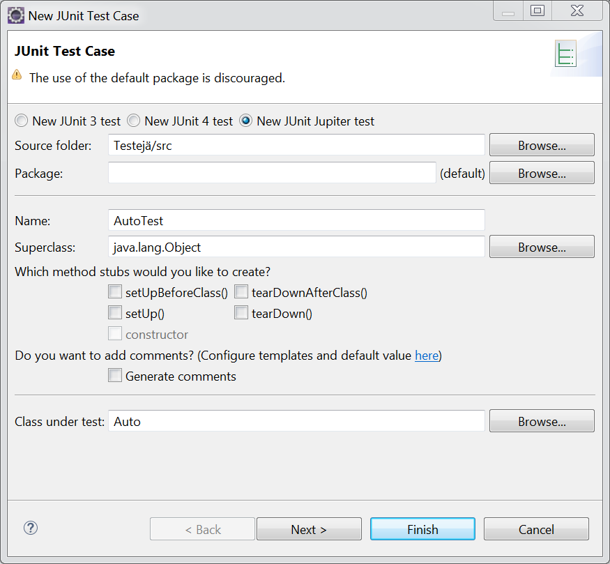

# Yksikkötestaus

## Yleistä

**Yksikkötestaaminen** \(engl. unit testing\) on tietokoneohjelman testaamisen ja laadunvarmistuksen menetelmä, jossa lähdekoodin osat testataan pienissä paloissa, esim. metodi kerrallaan. 

Tämä eroaa koko ohjelman testaamisesta yhtenä kokonaisuutena, josta yleensä puhutaan esim. _integraatiostestauksena_ \(järjestelmien osien yhteentoimivuuden testaus\), tai esim. _hyväksymistestauksena_ \(tilaaja hyväksyy toiminnallisuuden\). 

Yksikkötestaaminen suoritetaan tavallisesti automatisoidusti, mutta myös manuaalisesti suorittaminen on mahdollista. Testien kehittäminen voi vaatia paljon aikaa: jokaista Java-koodiriviä kohden tarvitaan keskimäärin 3–5 JUnit-koodiriviä riittävän kattavuuden saavuttamiseen. 

Tekniset standardit, kuten [IEC 61508](https://fi.wikipedia.org/w/index.php?title=IEC_61508&action=edit&redlink=1), voivat vaatia ohjelman yksikkötestaamista osana kehittämisprosessia.

## Testaaminen käytännössä

Erilaisia testialustoja on useita, mutta Javan yhteydessä [JUnit](https://junit.org/junit5/) on noussut lähes standardiksi. Sovelluskehittimissä onkin useimmiten valmiiksi ladattuna JUnit-kirjaston jokin versio.

Katsotaan alla esimerkki testien kirjoittamisesta yksinkertaisella esimerkillä. Luokkaan Matikkaa.java  on määritelty muutama yksinkertainen operaatio, jotka tarjoavat palveluita luokan ulkopuolelle staattisina metodeina. Main-metodissa on esitelty metodien toimintaa.



```java
public class Matikkaa {

	public static int summa(int eka, int toka) {
		return eka + toka;
	}
	public static double potenssi(int eka, int toka) {
		return Math.pow(eka, toka);
	}
	
public static void main(String[] args) {

		System.out.println( Matikkaa.summa(2, 3) );
		System.out.println( Matikkaa.potenssi(4, 2) );

	}
}
```



```

```



## Testien luominen

Seuraavaksi luomme JUnit-testiluokan, johon määritellään testejä. Testit ovat itseasiassa metodeja, jotka kutsuvat luokan toimintoja \(eli metodeja\) halutuilla arvoilla. Tämän jälkeen ne vastaanottavat metodien palauttamat arvot ja tulkitsevat niitä testin laatijan ohjeiden mukaan; testi hyväksytään tai hylätään palautuneista arvoista riippuen. 

Eclipsessä uuden testin voi luoda valitsemalla aktiivisessa projektissa File-&gt;New-&gt;JUnit Test Case tai napsauttamalla hiiren oikeaa nappia projektin päällä ja valitsemalla New-&gt;JUnit Test Case. Voit hyväksyä luomisen aikana esitetyissä ikkunoissa oletusasetukset napsattamalla Next/Finish.

te


Projektiin luotu testiluokka MatikkaaTest.java näyttää seuraavalta. Luokan alussa on JUnit-testien vaatimien kirjastojen import-lauseet. Oletuksena luokkaan on luotu yksi testi nimeltä test\(\), joka on oletuksena määritelty aina epäonnistumaan \(fail\). Huomaa, että jokaisen testin eteen on kirjoitettava @Test tägi. Tämä erottaa itse testitapaukset muista luokkaan mahdollisesti kirjoitettavista operaatioista.



```java
import static org.junit.jupiter.api.Assertions.*;
import org.junit.jupiter.api.Test;

class MatikkaaTest {

@Test
void test() {
    fail("Not yet implemented");
 }
}
```



Testin voi suorittaa samaan tapaan kuin minkä tahansa Java-sovelluksen napsauttamalla sovelluskehittimen Play/Run -nappulaa yläreunasta. Testin suorituksen jälkeen näet yhteenvedon testin tuloksista \(alla\). Tässä tapauksessa testi epäonnistuu odotetusti.


## Testien kirjoittaminen

Testit rakentuvat ajatukselle oletuksista \(assert\) siitä minkä arvon testattava ohjelman osa palauttaa tietyissä tilanteissa. Esim. metodia summa\(\) voidaan testata välittämällä sinne parametrina luvut 3 ja 2 ja tutkimalla palautusarvoa. Jos palautusarvo on kehittäjän olettama 5, testi onnistuu.

Palautusarvon tutkiminen tehdään JUnitissa käyttämällä tyypillisimmin metodeja **assertEquals\(\)**, **assertTrue\(\)** ja **assertFalse\(\)**. Täydellinen lista erilaisista assert-metodeista löytyy [JUnitin dokumentaatiosta](https://junit.org/junit5/docs/current/api/org/junit/jupiter/api/Assertions.html).

Alla on kirjoitettu äsken kuvattu testi JUnit-muotoon. Itse testimetodin nimi voi olla mitä vaan, mutta ohjelmalogiikan, ohjelmoijan työn mielekkyyden sekä testiraporttien selkeyden johdosta nimeämisessä kannattaa käyttää sellaista logiikkaa, joka kuvaa testin toimintaa ja tulosta mahdollisimman hyvin. 

Testi voidaan suorittaa kuten edellä ja siitä saatava raportti kertoo sen onnistuneen.



## Totuusarvot testeissä

Edellä kuvatuissa testeissä käytettiin numeroita ja testattiin yhtäsuuruutta. Kokeillaan seuraavaksi hyödyntää testeissä totuusarvoja ja testata niitä assertTrue\(\) ja assertFalse\(\) metodien avulla.

Seuraavassa luokkaan Matikka.java on luotu metodi löytyyköLuku\(\), joka etsii parametrina annetusta taulukosta toisena parametrina annettua lukua. Metodi palauttaa arvon true jos luku löytyy ja muussa tapauksessa luvun false.



```java
public static boolean löytyyköLuku(int[] taulu, int luku) {
    for (int i = 0; i < taulu.length; i++) {
        if (taulu[i] == luku)
            return true;
    }
    return false;
}
```



Sitten kirjoitetaan testi luokkaan MatikkaTest, jossa ensin luodaan 100-alkioinen testitaulukko ja sijoitetaan sinne etsittävä arvo alkioon 29. Tämän jälkeen kutsutaan metodia löytyyköLuku\( taulu, 21 \). Jos alkio löytyy, palautetaan arvo true jolloin assertTrue\(\) metodi tulkitsee testin onnistuneeksi.



```java
@Test
void lukuLöytyy() {

    // Alustetaan taulu 
    int[] taulu = new int[100];
    
    // ja lisätään sinne luku 21    
    taulu[29] = 21;
    // Suoritetaan testi        
    assertTrue(Matikkaa.löytyyköLuku(taulu, 21));
}

```



## Syötteen vaatiman ohjelman testaaminen 

Lorem ipsum

## Test Driven Development \(TDD\)

Lorem ipsum

